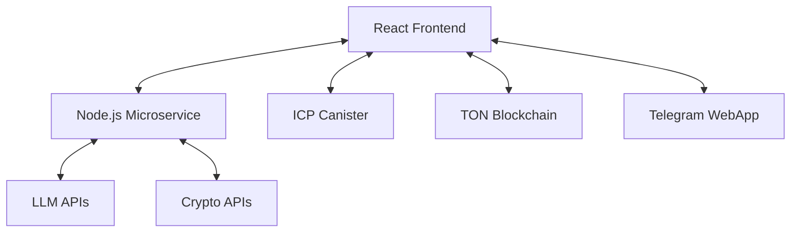

# Olivia AI - Web3 AI Assistant Platform

A decentralized AI assistant platform that combines blockchain technology, real-time AI communication, and cryptocurrency trading tools into a unified Web3 experience.

## 🏗️ Architecture Overview

This project consists of three main components:

### 1. **React Frontend** (`src/`)
- Modern React 18 SPA with real-time AI chat interface
- Multi-blockchain authentication (ICP, TON, Telegram)
- Immersive crypto data visualizations
- WebSocket-based streaming AI responses

### 2. **Node.js Microservice** (`microservice/`)
- Secure API gateway for external services
- WebSocket proxy for real-time LLM communication
- Authentication and rate limiting middleware
- Integration with multiple crypto APIs

### 3. **ICP Backend** (`icp_backend/`)
- Motoko canister for decentralized data storage
- Persistent chat history on Internet Computer blockchain
- User management with Internet Identity integration



## 🚀 Tech Stack

### Frontend
- **Framework**: React 18 + Vite
- **Styling**: TailwindCSS + HeroUI
- **Web3**: @tonconnect/ui-react, @dfinity/agent
- **Real-time**: WebSocket API
- **Charts**: Chart.js + D3.js
- **Animation**: Framer Motion

### Microservice
- **Runtime**: Node.js + Express
- **Security**: Helmet, CORS, Rate Limiting
- **WebSocket**: ws library for proxy connections
- **Authentication**: JWT tokens

### ICP Backend
- **Language**: Motoko
- **Platform**: Internet Computer Protocol
- **Storage**: Stable memory with HashMap

## 🔧 Setup Instructions

### Prerequisites
- Node.js 18+
- DFX (Internet Computer SDK) - [Install Guide](https://internetcomputer.org/docs/current/developer-docs/setup/install/)
- Environment variables configured

#### Installing DFX (Internet Computer SDK)
```bash
# Install DFX
sh -ci "$(curl -fsSL https://internetcomputer.org/install.sh)"

# Verify installation
dfx --version

# Create new identity (optional, for production deployments)
dfx identity new <your-identity-name>
dfx identity use <your-identity-name>
```

### 1. Frontend Setup
```bash
# Install dependencies
npm install

# Start development server
npm run dev

# Build for production
npm run build
```

### 2. Microservice Setup
```bash
cd microservice

# Install dependencies
npm install

# Configure environment variables
cp .env.example .env
# Edit .env with your API keys and configuration

# Start microservice
npm run dev
```

### 3. ICP Backend Setup
```bash
# Start local ICP network
npm run icp:start

# Deploy canister (will generate new canister ID)
npm run icp:deploy

# Note the canister ID from deployment output
# Update your frontend .env with: VITE_ICP_CANISTER_ID=<your_new_canister_id>

# Check canister status
npm run icp:status
```

## 📁 Project Structure

```
OliviaAIweb3/
├── src/                          # React Frontend
│   ├── components/
│   │   ├── auth/                 # Authentication components
│   │   ├── features/             # Feature-specific components
│   │   ├── layout/               # App layout components
│   │   └── ui/                   # Reusable UI components
│   ├── contexts/                 # React Context providers
│   ├── hooks/                    # Custom React hooks
│   ├── api/                      # API services and configuration
│   └── pages/                    # Route components
├── microservice/                 # Node.js API Gateway
│   ├── src/
│   │   ├── controllers/          # API route handlers
│   │   ├── middleware/           # Security and validation
│   │   ├── routes/               # API route definitions
│   │   └── services/             # Business logic services
│   └── tests/                    # Test suites
├── icp_backend/                  # Internet Computer Backend
│   └── src/
│       └── icp_backend_backend/
│           └── main.mo           # Motoko canister code
└── public/                       # Static assets
```

## 🔐 Authentication System

The platform supports multiple authentication methods:

### Internet Identity (ICP)
- Blockchain-based identity using Face ID/Touch ID
- Stores data permanently on Internet Computer
- No passwords required

### TON Connect
- TON blockchain wallet integration
- Supports hardware and software wallets
- Automatic account linking

### Telegram WebApp
- Native Telegram bot integration
- Seamless user experience within Telegram
- Social authentication

### Guest Mode
- Temporary access without registration
- Limited features with upgrade prompts
- Easy conversion to permanent accounts

## 🌐 Real-Time Communication

### WebSocket Architecture
The platform uses a sophisticated WebSocket system for real-time AI communication:

```javascript
// WebSocket connection through secure microservice proxy
const wsUrl = `${MICROSERVICE_URL}/ws/secure-proxy?token=${AUTH_TOKEN}`;
const ws = new WebSocket(wsUrl);

// Handle streaming AI responses
ws.onmessage = (event) => {
  const message = JSON.parse(event.data);
  switch(message.type) {
    case 'ai_response_chunk':
      // Handle streaming response
      break;
    case 'action_request':
      // Handle AI action requests
      break;
  }
};
```

### Features
- **Secure Proxy**: All LLM communication routed through authenticated microservice
- **Auto-Reconnection**: Exponential backoff with multiple endpoint fallback
- **Heartbeat Monitoring**: Connection health checks every 30 seconds
- **Message Queuing**: Handles offline scenarios gracefully

## 💰 Crypto Integration

### Supported Services
- **Market Data**: Real-time cryptocurrency prices and analytics
- **Exchange Integration**: Swap and trading functionality
- **Blockchain Data**: On-chain analytics and insights
- **DEX Integration**: Decentralized exchange connections

### Floating Data Bubbles
Interactive data overlays that appear contextually during AI conversations:

```javascript
// Example: Price bubble appears when crypto is mentioned
const FloatingPriceBubble = ({ coin, data }) => {
  // Dynamic positioning and content based on AI context
  return (
    <div className="floating-bubble" style={{ 
      position: 'absolute',
      left: position.x,
      top: position.y 
    }}>
      {/* Real-time price data */}
    </div>
  );
};
```

## 🛡️ Security Features

### Frontend Security
- **Content Security Policy**: Helmet.js security headers
- **Origin Validation**: CORS protection with specific origins
- **Input Sanitization**: XSS protection on all user inputs
- **Token Management**: Secure storage of authentication tokens

### Microservice Security
- **Rate Limiting**: Configurable request limits per endpoint
- **JWT Authentication**: Token-based API access control
- **Environment Variables**: Sensitive data stored in environment
- **Proxy Pattern**: API keys hidden behind secure microservice

### ICP Security
- **Identity-Based Access**: Each user's data isolated by Principal ID
- **Blockchain Storage**: Immutable and verifiable data storage
- **Upgrade Safety**: Stable memory preserves data during updates

## 🎨 UI/UX Features

### Design System
- **Dark Theme**: Modern dark UI with neon accents
- **Responsive Design**: Mobile-first approach with desktop optimization
- **Animations**: Smooth transitions using Framer Motion
- **Typography**: Custom prose styling for markdown content

### Interactive Elements
- **Voice Input**: Audio recording and transcription
- **Drag & Drop**: Moveable data bubbles and components
- **Real-time Updates**: Live data streaming and updates
- **Context Menus**: Right-click actions and shortcuts

## 🔄 State Management

### React Context Architecture
```javascript
// Provider hierarchy from main.jsx
<AuthProvider>           // User authentication state
  <InternetIdentityProvider>  // ICP identity management
    <WebSocketProvider>        // Real-time connection state
      <ChatProvider>           // Chat-specific state
        <App />
      </ChatProvider>
    </WebSocketProvider>
  </InternetIdentityProvider>
</AuthProvider>
```

### Key Contexts
- **AuthContext**: Multi-auth state management
- **WebSocketContext**: Real-time communication
- **InternetIdentityContext**: ICP blockchain integration
- **ChatContext**: Conversation state and history

## 📊 Data Flow

### Chat Message Flow
1. User inputs message in chat interface
2. Frontend sends via WebSocket to microservice proxy
3. Microservice routes to appropriate LLM API
4. Streaming response flows back through WebSocket
5. Frontend renders real-time response with typing animation
6. Completed conversation saved to ICP blockchain

### Crypto Data Flow
1. AI mentions cryptocurrency in response
2. Frontend detects crypto keywords
3. Relevant API calls made through microservice
4. Data formatted and displayed in floating bubbles
5. User can interact with bubbles for more details

## 🧪 Development

### Environment Variables
Create `.env` files in both root and microservice directories:

```bash
# Frontend (.env)
VITE_API_GATEWAY_URL=your_api_gateway_url
VITE_OPENAI_MICROSERVICE_URL=http://localhost:3001
VITE_APP_ACCESS_TOKEN=your_access_token
VITE_ICP_CANISTER_ID=<canister_id_from_dfx_deploy>

# Microservice (.env)
PORT=3001
NODE_ENV=development
ADMIN_ACCESS_SECRET=your_admin_secret
LLM_API_KEY=your_llm_api_key
CRYPTO_API_KEYS=your_crypto_api_keys
ALLOWED_ORIGIN=http://localhost:3000
EXTERNAL_WEBSOCKET_URLS=your_llm_websocket_endpoints
```

### Scripts
```bash
# Development
npm run dev                    # Start frontend only
npm run setup                  # Full development setup

# ICP Commands
npm run icp:start             # Start local ICP network
npm run icp:deploy            # Deploy canister
npm run icp:clean             # Clean and restart ICP

# Testing
npm run test:integration      # Frontend integration tests
cd microservice && npm test  # Microservice test suite
```

### Development Tips
- Use browser dev tools for WebSocket message debugging
- Monitor microservice logs for API call patterns
- Use DFX dashboard for ICP canister inspection
- Test authentication flows with different user types

## 🚀 Deployment

### Frontend Deployment
- Build optimized bundle with `npm run build`
- Deploy to CDN or static hosting service
- Configure environment variables for production

### Microservice Deployment
- Use containerization for consistent deployment
- Set up environment variables in production
- Configure rate limiting and security headers
- Monitor API usage and performance

### ICP Deployment

#### Local Development
1. Start local ICP network: `npm run icp:start`
2. Deploy canister: `npm run icp:deploy`
3. Copy the canister ID from the deployment output
4. Update your `.env` file: `VITE_ICP_CANISTER_ID=<your_canister_id>`
5. Restart your frontend development server

#### Production Deployment
1. Deploy to Internet Computer mainnet: `dfx deploy --network ic`
2. Note the production canister ID from deployment output
3. Update production environment variables with new canister ID
4. Test identity integration with production canisters

#### Getting Canister ID
After running `dfx deploy`, you'll see output like:
```
Deployed canisters.
URLs:
  Backend canister via Candid interface:
    icp_backend_backend: http://127.0.0.1:4943/?canisterId=rdmx6-jaaaa-aaaaa-aaadq-cai&id=rrkah-fqaaa-aaaaa-aaaaq-cai
```
Use the second ID (`rrkah-fqaaa-aaaaa-aaaaq-cai` in this example) as your `VITE_ICP_CANISTER_ID`.

## 📈 Performance Optimization

### Frontend Optimizations
- **Code Splitting**: Dynamic imports for route-based chunks
- **WebSocket Pooling**: Efficient connection management
- **Memoization**: React.memo and useMemo for expensive operations
- **Asset Optimization**: Vite's built-in optimizations

### Backend Optimizations
- **Connection Pooling**: Efficient database and API connections
- **Caching Strategies**: Redis or in-memory caching
- **Rate Limiting**: Prevent API abuse and manage costs
- **Load Balancing**: Scale microservice horizontally

## 🤝 Contributing

1. Fork the repository
2. Create a feature branch (`git checkout -b feature/amazing-feature`)
3. Commit your changes (`git commit -m 'Add amazing feature'`)
4. Push to the branch (`git push origin feature/amazing-feature`)
5. Open a Pull Request

### Development Guidelines
- Follow React best practices and hooks patterns
- Use TypeScript for type safety where applicable
- Write tests for new features and API endpoints
- Maintain consistent code style with ESLint/Prettier
- Document API changes and new environment variables

## 📄 License

This project is licensed under the MIT License - see the LICENSE file for details.

## 🆘 Support & Troubleshooting

### Common Issues

#### ICP Setup Issues
- **"dfx not found"**: Install DFX using the command in Prerequisites section
- **"Port 4943 already in use"**: Stop existing DFX with `dfx stop` before starting
- **"Canister not found"**: Ensure you've deployed with `npm run icp:deploy` and updated `.env`
- **"Network error"**: Check if local ICP network is running with `dfx ping`

#### Frontend Issues
- **WebSocket connection failed**: Verify microservice is running on port 3001
- **Authentication errors**: Check if all auth providers are properly configured
- **Missing environment variables**: Copy `.env.example` and fill in required values

#### Microservice Issues
- **Port conflicts**: Change PORT in microservice `.env` if 3001 is occupied
- **API key errors**: Verify all required API keys are set in microservice `.env`
- **CORS errors**: Ensure ALLOWED_ORIGIN matches your frontend URL

For additional support:
- Check the Issues tab for common problems
- Review the development logs for error details
- Ensure all environment variables are properly configured
- Verify microservice and ICP backend are running correctly

---

**Note**: This is a development guide. Ensure all API keys and sensitive configuration are properly secured before deploying to production.
